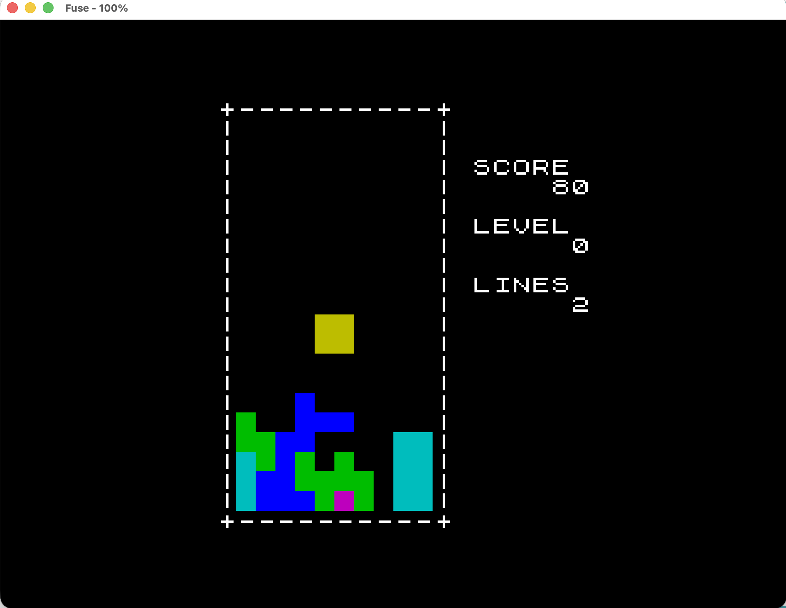

# Tetris for ZX Spectrum 128K

Classic Tetris written in C, cross-compiled with [z88dk](https://github.com/z88dk/z88dk)
to Z80 machine code, packaged as a `.tap` tape image, runs in
[Fuse](https://fuse-emulator.sourceforge.net/).



A pet project to learn low-level 8-bit programming on real (well, emulated)
hardware. Built from scratch: 1 cell = 1 character cell, direct writes to
screen RAM at `0x4000` and the attribute file at `0x5800`, no high-level
graphics library.

## Features

- 7 tetrominoes (I, O, T, S, Z, L, J) with 4 rotations each, classic colours.
- Gravity with NES-style level table: starts at ~1 second per row,
  speeds up every 10 lines cleared, kill-screen at level 29.
- NES scoring: 40 / 100 / 300 / 1200 points per 1 / 2 / 3 / 4 lines,
  multiplied by `level + 1`.
- Soft drop, hard drop, rotate with collision/wall checks.
- Live HUD: `SCORE`, `LEVEL`, `LINES`, redrawn only on change to avoid flicker.
- Beeper SFX: short click on lock, ascending three-note on line clear,
  descending tone on game over.
- Game over screen with restart on Enter.

## Controls

| Key                     | Action                  |
|-------------------------|-------------------------|
| `←` / `→`               | Move left / right       |
| `↓`                     | Soft drop (held)        |
| `↑` or `Enter`          | Rotate clockwise        |
| `Space`                 | Hard drop (instant lock)|
| `Enter` (on game over)  | Restart                 |

On a Mac in Fuse, the keyboard arrows are mapped to `Caps Shift + 5/6/7/8`
on the Spectrum keyboard, which is what the code actually reads.

## Build with Docker (recommended)

Host requirements: Docker (with Compose plugin, default in modern Docker
Desktop) and a ZX Spectrum emulator — on macOS that's
[Fuse](https://formulae.brew.sh/cask/fredm-fuse) (`brew install --cask fredm-fuse`).
The z88dk toolchain lives inside the image — no local clone, no 20-minute
build on your machine.

```sh
docker compose build                            # one-time, ~15-20 min — builds z88dk
docker compose run --rm builder                 # produces build/tetris.tap
docker compose run --rm builder make clean      # removes build/
```

Same commands work in bash, zsh, fish, and PowerShell — no `make`
required on the host.

The container runs the `make` recipe defined in this `Makefile` (its
`CMD` in the Dockerfile is `make`). It produces `build/tetris.tap` via
a bind-mount and exits. Fuse runs natively because it's a GUI app.

Open the resulting tape in your emulator:

```sh
open -a Fuse build/tetris.tap        # macOS
fuse build/tetris.tap                # Linux
# Windows: open build\tetris.tap with your Spectrum emulator of choice
```

In Fuse: `Machine → Select → Spectrum 128`, `Options → Sound → Enabled`.
The tape auto-loads.

**Linux ownership note.** By default the container runs as
`UID:GID = 1000:1000`. If your host UID isn't 1000, files in `build/`
will be owned by that fixed UID. Fix by creating `.env`:

```sh
echo "UID=$(id -u)"  > .env
echo "GID=$(id -g)" >> .env
```

macOS and Windows Docker Desktop bind-mounts handle ownership transparently;
no `.env` needed.

## Build natively (without Docker)

If you already have z88dk on your machine (or prefer the fastest possible
edit-build cycle):

Requirements:

- [z88dk](https://github.com/z88dk/z88dk) installed at `~/tools/z88dk` (or
  adjust `Z88DK` env var). Build from source: `git clone --recursive ...
  && ./build.sh`. On macOS you'll also need `gmp` and `gmake`:
  `brew install gmp make`.
- [Fuse for Mac](https://formulae.brew.sh/cask/fredm-fuse):
  `brew install --cask fredm-fuse`.

```bash
export Z88DK=$HOME/tools/z88dk
export PATH=$Z88DK/bin:$PATH
export ZCCCFG=$Z88DK/lib/config

make           # produces build/tetris.tap
make run       # builds and opens the .tap in Fuse
make clean     # removes build/
```

## Project structure

```
src/
  main.c       orchestration: frame loop, input dispatch, game-over screen
  game.c/h     state (struct G), gravity, collisions, lock, line clear, scoring
  pieces.c/h   tetromino bitmaps (uint16_t for 4×4) and colours
  render.c/h   direct screen writes, ROM-font glyph copy for text/HUD
  input.c/h    keyboard polling with autorepeat and edge detection
  sound.c/h    three SFX through z88dk bit_beep
Makefile       z88dk newlib build (-clib=new, -create-app)
zpragma.inc    memory layout pragmas for 128K (STACKPTR, CRT_ORG_CODE)
docs/tasks/    incremental build plan (10 tasks, RU)
```

The whole game state lives in one global `game_state_t G` (see [src/game.h](src/game.h)).
Dependency direction is strictly `main → game → render`, no cycles.
`render` knows nothing about game state — it only draws cells and copies
text glyphs at given char-cell coordinates.

## Architecture notes

A few non-obvious decisions, documented because they took some debugging:

- **No `printf`.** The newlib `+zx` console driver with the default
  `-startup=0` does not interpret `\x16 row col` AT-control bytes — they
  print as raw glyphs. All text is drawn by copying 8-byte ROM-font glyphs
  from `0x3C00 + ch*8` directly into screen bitmap. Same path is used for
  the HUD numbers (custom `u32_to_padded` instead of `sprintf`).
- **Attribute clash as a feature.** The ZX Spectrum has a 32×24 attribute
  grid, so colour is per character cell, not per pixel. The playfield is
  10×20 character cells — each tetromino square is exactly one cell, and
  the colour comes from the attribute byte. No clash, no anti-aliasing
  headaches.
- **`intrinsic_ei()` before every `intrinsic_halt()`.** Something deep in
  the newlib startup or in `zx_cls_attr` leaves IFF1=0 on entry to the
  main loop. Without an explicit `EI`, the first `HALT` blocks forever.
- **Compiler:** sccz80 (the default for `-clib=new`). It's strict C89:
  no `inline`, no `for (uint8_t i = 0; ...)` declarations inside `for`,
  all locals at the top of the block. The codebase follows that.
- **`zx_cxy2saddr(x, y)` argument order.** First arg is column, second is
  row — easy to swap and produces a transposed picture (got me once).

## Workflow

Development was driven by [docs/tasks/INDEX.md](docs/tasks/INDEX.md) —
ten incremental tasks from toolchain setup to sound effects. Each task
has its own spec file with acceptance criteria. Completion notes at the
bottom of each task capture decisions that diverged from the original
plan (most often: replacing `printf` with direct rendering).

## References

- z88dk: [wiki](https://github.com/z88dk/z88dk/wiki/Platform---Sinclair-ZX-Spectrum),
  [getting started for newlib](https://github.com/z88dk/z88dk/blob/master/doc/ZXSpectrumZSDCCnewlib_GettingStartedGuide.md)
- ZX Spectrum hardware: [worldofspectrum.org](https://worldofspectrum.org/),
  [breakintoprogram.co.uk/hardware/computers/zx-spectrum](http://www.breakintoprogram.co.uk/hardware/computers/zx-spectrum/screen-memory-layout),
  [sinclair.wiki.zxnet.co.uk](https://sinclair.wiki.zxnet.co.uk/)
- NES Tetris scoring & speed: [Tetris Wiki — Tetris (NES)](https://tetris.wiki/Tetris_(NES,_Nintendo))
- Fuse emulator: [fuse-emulator.sourceforge.net](https://fuse-emulator.sourceforge.net/)

## License

MIT (or whatever you want — it's a learning project, not for sale).
